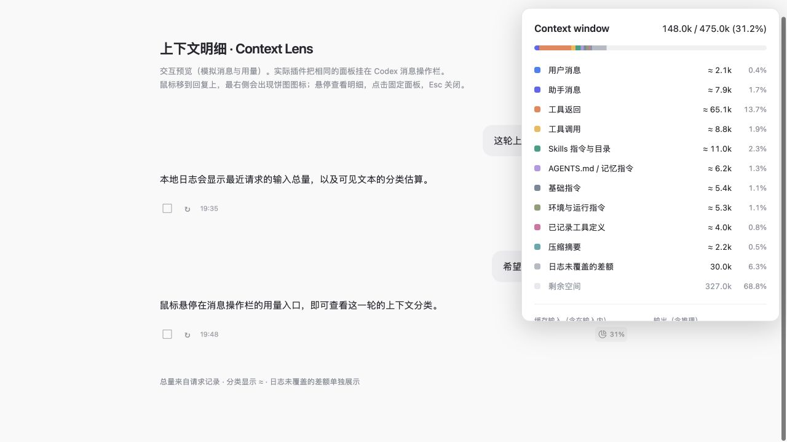
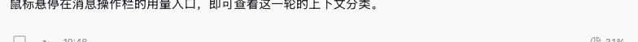

<p align="center">
  
</p>

<h1 align="center">Codex Context Lens</h1>

<p align="center"><strong>在回复旁，看清上下文占用。</strong></p>

<p align="center">
  <a href="https://github.com/Cloudkkk/codex-context-lens/actions/workflows/ci.yml"></a>
  <a href="LICENSE"></a>
  
  
</p>

Context Lens 是一个用于 macOS Codex / ChatGPT 桌面端的第三方本地插件。它读取本机的 Codex 会话日志，在每条已完成回复的操作栏最右侧显示上下文用量，并通过悬停面板展示分类汇总。

入口采用 **16px SVG 图标和原生操作栏灰色**，默认隐藏，鼠标移到回复上才显示。查看用量无需发送聊天消息，也无需 API Key 或独立启动器。

<p align="center">
  <a href="#安装">安装</a> · <a href="#使用">使用</a> · <a href="#更新">更新</a> · <a href="#常见问题">常见问题</a> · <a href="CONTRIBUTING.md">贡献</a>
</p>



*预览使用模拟消息和用量，用于展示界面；实际面板读取你的本地会话日志。*

## 功能

- **消息旁直接查看**：回复操作栏右侧的饼图图标与百分比，hover 查看、点击固定、Esc 关闭。
- **历史轮次回放**：每个入口对应自己的会话和轮次，旧回复显示当时的用量。
- **上下文分类**：用户消息、助手消息、工具调用与返回、Skills、基础指令、记忆指令、压缩摘要等。
- **压缩感知**：使用日志中的替换历史重建上下文，避免把压缩前的数字套到新窗口。
- **自动监控**：通过受信任的 `SessionStart` hook 启动，并在窗口刷新后重新挂载。
- **本地运行**：Python 标准库实现，只读 `~/.codex/sessions`，不需要额外服务或第三方 Python 依赖。

分类目前只展示汇总。详细条目的展开入口暂时关闭，待内容归因更清楚后再加入。

## 安装

### 环境要求

| 项目 | 要求 |
| --- | --- |
| 桌面端 | macOS 上的 Codex 或集成 Codex 的 ChatGPT 桌面端 |
| Python | Python 3.9+，可通过 `python3` 调用 |
| Codex CLI | 仅命令行注册来源或安装时需要；桌面本地目录安装不要求 CLI |
| 日志 | 本机已有 Codex 本地会话，默认目录为 `~/.codex/sessions` |
| Node.js | 仅开发和运行 JavaScript 测试需要；使用插件不需要 |

### 从 Release 安装

完整操作说明见 **[安装与使用手册 INSTALL.md](INSTALL.md)**；下载包内也包含同一份手册。

1. 到 [最新 Release](https://github.com/Cloudkkk/codex-context-lens/releases/latest) 下载 `codex-context-local.zip`，解压并移动到个人主目录，例如 `~/codex-context-local`。
2. 在桌面本地聊天中让 Codex 登记该目录为本地 plugin marketplace，只登记来源。
3. 重新打开桌面端，在插件目录选择来源 **本地上下文面板**，安装并启用 **上下文明细 · Context Lens**。
4. 刷新 **设置 → Hooks**，审核并信任插件的 `SessionStart`。
5. 新建本地聊天并发送消息。若监控状态为 `waiting_for_app_exit`，任务结束后 ⌘Q 完全退出一次，等待自动重开。
6. 回复完成后，鼠标移到回复上，再 hover 最右侧的饼图按钮。

使用 **0.2.12 或更新版本**。不要在「创建插件」里上传 ZIP；账户上传来源不加载本包的本机 hook。

[官方 OpenAI 文档](https://developers.openai.com/plugins/build/plugins#bundled-mcp-servers-and-lifecycle-hooks)说明了本地来源、hook 信任与执行环境要求。

### 从 GitHub 登记来源（可选）

不下载 ZIP 时，也可以登记 Git 来源，再按手册在桌面端安装、信任并使用：

```sh
codex plugin marketplace add https://github.com/Cloudkkk/codex-context-lens.git
```

完全通过 CLI 安装时，登记之后再运行 `codex plugin add context-lens@codex-context-local`。终端找不到 `codex` 时，可让桌面聊天调用应用自带的 CLI；不要把终端命令直接当作聊天请求发送。

## 使用



| 操作 | 效果 |
| --- | --- |
| 鼠标移到回复上 | 显示最右侧的图标与百分比 |
| 悬停图标 | 打开这一轮的上下文汇总 |
| 点击图标 | 固定面板，再次点击可关闭 |
| 按 Esc 或点击面板外 | 关闭面板 |
| 键盘聚焦入口 | 显示入口并打开面板 |
| 关闭插件开关 | 约 5 秒内停止监控，撤掉面板并取消待执行的重开 |

只有已完成、有用量记录且能够唯一匹配到日志轮次的回复才显示入口。正在生成的回复需要等结束；纯 CLI 会话不提供桌面悬停面板。

## 更新

先刷新 Git marketplace，再安装更新版本：

```sh
codex plugin marketplace upgrade codex-context-local
codex plugin add context-lens@codex-context-local
```

之后新建或恢复聊天，让 hook 启动新版监控。更新 hook 后，如设置中显示需要审核，请重新信任。

有源码 checkout 时，也可以从仓库根目录立即重载面板：

```sh
python3 plugins/context-lens/cli.py enable
```

查看版本变化见 [CHANGELOG.md](CHANGELOG.md)。

## 用量如何计算

**总量来自该轮最后一次请求的 `input_tokens`。** 全会话累计消耗包含历史请求，不能当作当前窗口占用；缓存输入属于输入的一部分，不重复相加。

**分类是日志可见文本的估算。** 当前采用字符启发式，不是模型 tokenizer 的精确分项。无法从日志恢复的工具定义、图片、加密块和估算误差统一显示为差额。

发生压缩后，插件使用 `compacted.replacement_history` 重建上下文。如果刚压缩但还没有新的请求用量，显示未知，而不沿用旧统计。

完整口径、匹配规则和实现结构见 [架构说明](docs/architecture.md)。

## 常见问题

### 为什么 Hooks 没有 Context Lens

本地插件未安装或未启用时，不会出现其 hook。来源登记和插件安装是两步。

如果通过「创建插件」上传 ZIP，当前客户端只加载了 skills，没有加载 hook；请按安装章节改用本地 marketplace 版本。

需要核对时，可让 Codex 检查：

```sh
codex plugin list --marketplace codex-context-local --available --json
```

`installed: false` 表示只是可发现，尚未安装。已安装后仍不见 hook，请确认启用状态、重新打开桌面端并刷新 Hooks；同时检查安装目录内的 `hooks/hooks.json`。

### 已安装，但没有图标

如果来自「创建插件」账户上传，首先检查插件来源：当前 `created-by-me-remote` 安装已实际确认没有 hook 能力。应换用本地 marketplace 安装，而不是重复上传、重启或调整 hover 样式。

先把鼠标移到已完成的回复上，入口默认隐藏。如果仍未出现，检查 hook 是否受信任、是否触发了本地会话启动，以及应用是否开放了本地调试端口。

有源码 checkout 时可查看诊断：

```sh
python3 plugins/context-lens/cli.py status
```

`attached` 只说明连接到了窗口。`windows` 中的 `buttons > 0` 才说明入口已挂载。

| 状态或原因 | 含义 |
| --- | --- |
| `waiting_for_app_exit` | 等待首次正常退出，随后自动带调试参数重开 |
| `reopening_app` | 正在等待重开的应用开放端口 |
| `restart_failed` | 自动重开后端口仍不可用，或启动失败 |
| `waiting_for_renderer` | 调试端口可用，但尚未连接到主窗口 |
| `no_logged_turns` | 当前会话还没有可用的本地轮次记录，临时新建会话也可能出现此状态 |
| `no_turn_match` | 界面内容或标识不能唯一对应到日志轮次 |
| `no_action_rows` | 当前版本的消息操作栏结构不兼容 |

切换聊天后会话标识尚未同步时，先切到另一条聊天，再返回原聊天。普通入口更新无需重启整个桌面端。

### 为什么总量准确，分类却带有「≈」

请求用量事件记录了真实输入总量，但日志不一定保存完整服务器端 prompt。分类只能对可见文本估算，不能把差额伪装成精确的 MCP 或系统工具占用。

### 退出应用后会不会一直被重开

不会。只有监控已发现一个缺少调试端口的运行实例时，才在其退出后尝试重开一次。已成功连接的应用正常退出后会保持退出；启动失败也不会进入循环。

### 是否支持 Windows、Linux 或官方公共插件目录

当前桌面自动接入仅支持 macOS。Windows / Linux 尚未提供桌面 bootstrap。

此版本使用 lifecycle hooks，按当前[官方规则](https://developers.openai.com/plugins/build/plugins#bundled-mcp-servers-and-lifecycle-hooks)不适用于官方公共插件目录。可通过 Git marketplace 或 ZIP 分发。

## 卸载

先在插件页关闭 Context Lens，或在源码目录运行 `stop`，再移除插件和来源：

```sh
python3 plugins/context-lens/cli.py stop
codex plugin remove context-lens@codex-context-local
codex plugin marketplace remove codex-context-local
```

会话日志不会被删除。卸载不会改变已经运行的桌面应用启动参数；完全退出后正常打开即可。

## 开发与贡献

```sh
git clone https://github.com/Cloudkkk/codex-context-lens.git
cd codex-context-lens
PYTHONDONTWRITEBYTECODE=1 PYTHONPATH=plugins/context-lens python3 -m unittest discover -s plugins/context-lens/tests -v
node --test plugins/context-lens/tests/test_matching.cjs
```

当前有 **26 项 Python 测试和 12 项 JavaScript 测试**。CI 在 Linux 与 macOS 上运行合成数据测试；真实桌面挂载仍需要手动验证。

发布前从仓库根目录运行 `python3 scripts/package.py`，生成唯一的 `codex-context-local.zip` 分发包。脚本只收录 Git 已跟踪文件，校验插件 manifest、hook 引用、运行文件与 marketplace 路径；CI 同样检查打包。

贡献流程见 [CONTRIBUTING.md](CONTRIBUTING.md)，安全边界与问题反馈见 [SECURITY.md](SECURITY.md)。

## 致谢与许可

- [Codex-Monitor](https://github.com/KevinKE93/Codex-Monitor)：本地 CDP 接入思路与消息 DOM 标记。
- [Context Window Inspector](https://github.com/androidZzT/context-window-inspector)：会话日志和上下文归因思路。
- [OpenAI Plugins documentation](https://developers.openai.com/plugins/build/plugins)：插件格式、marketplace 与 hook 规范。

本仓库代码独立实现，采用 [MIT License](LICENSE)。
